# Tauri Plugin Any-Sync

Tauri plugin local-first storage with P2P synchronization using [Any-Sync](https://tech.anytype.io/any-sync/overview) (and [Any-Store](https://github.com/anyproto/any-store))

## Overview

This plugin is a thin wrapper for the Any-Sync Go backend with a Rust and TypeScript API for Tauri applications. It provides a unified interface for local-first data storage and synchronization across desktop and mobile platforms.

## Architecture

```mermaid
graph LR
    subgraph APP["Tauri application"]
        TS["Frontend<br/>(Svelte/React/Vue)"]
        RB["Backend<br/>(Rust)"]
    end

    subgraph PLA["Plugin API"]
        API["guest-js<br/>(TypeScript API)"]
    end

    subgraph PLG["Tauri plugin (Rust)"]
        CMD["⌘ commands.rs<br/>(Plugin Router)"]
    
        subgraph "Platform Layer"
            DT["🖥️ desktop.rs<br/>(macOS/linux/windows)"]
            MB["📱 mobile.rs<br/>(iOS/android)"]
        end
    end
    
    subgraph "Go backend"
        SB["🛺 Desktop sidecar<br/>(bundled)"]
        AAR["🤖 Android .aar<br/>(integrated)"]
        XCF[" iOS .xcframework<br/>(integrated)"]
        AS["🔄 Any-Sync </br> 🗃️ Any-Store"]
    end
    
    TS --> API
    RB --> CMD
    TS <--> RB
    API --> CMD
    CMD --> DT
    CMD --> MB

    DT -.-|Sidecar IPC| SB --- AS
    MB -.-|gomobile FFI| AAR --- AS
    MB -.-|gomobile FFI| XCF --- AS
    
    style TS fill:#4a90e2,color:#fff
    style RB fill:#4a90e2,color:#fff
    style API fill:#7b68ee,color:#fff
    style CMD fill:#7b68ee,color:#fff
    style DT fill:#f5a623,color:#fff
    style MB fill:#f5a623,color:#fff
    style AS fill:#ff9500,color:#fff
    style SB fill:#ff7043,color:#fff
    style AAR fill:#ff7043,color:#fff
    style XCF fill:#ff7043,color:#fff
```



**Key Design Patterns**:
- **Desktop** (macOS/Linux/Windows): Sidecar process (Go executable bundled with app, gRPC IPC)
- **Mobile** (Android/iOS): gomobile embedded library (Go compiled as .aar/.xcframework, direct JNI/FFI calls)
- **Unified API**: Single TypeScript interface across all platforms (>95% shared Go code)
- **Communication**: Platform-appropriate transport (gRPC for desktop, native calls for mobile)

## Quick Start

### Prerequisites

- **Go**: 1.21+ (for backend)
- **Rust**: 1.77+ (for plugin)
- **Node.js**: 18+ (for development)
- **protoc**: Protocol Buffer compiler

### Installation

The plugin automatically downloads pre-compiled Go backend binaries from GitHub Releases. This is the easiest way to integrate the plugin.

1. **Add the plugin to your Tauri app:**

   ```bash
   tauri add tauri-plugin-any-sync
   ```

2. **Select platform features** in your `src-tauri/Cargo.toml`:

   For macOS + Linux + Windows (all platforms):
   
   ```toml
   [dependencies]
   tauri-plugin-any-sync = { version = "0.1", features = ["all"] }
   ```
   
   Or
   
   ```toml
   tauri-plugin-any-sync = { version = "0.1", features = ["macos", "linux"] }
   ```
   
   Or for specific platforms:

   ```toml
   tauri-plugin-any-sync = { version = "0.1", features = ["x86_64-apple-darwin", "aarch64-apple-darwin"] }
   ```

   **Available Features:**
   - Platform-specific: `x86_64-apple-darwin`, `aarch64-apple-darwin`, `x86_64-unknown-linux-gnu`, `aarch64-unknown-linux-gnu`, `x86_64-pc-windows-msvc` (based on `$TARGET_TRIPLE`)
   - Platform groups: `macos`, `linux`, `windows`
   - All platforms: `all`

3. **Update `src-tauri/build.rs` script** to link binaries directory:

   ```rust
   use std::{env, fs, path::Path};
   
   fn main() {
       // Link binaries directory from plugin
       if let Ok(binaries_dir) = env::var("DEP_TAURI_PLUGIN_ANY_SYNC_BINARIES_DIR") {
           let dest_dir = Path::new(&env::var("CARGO_MANIFEST_DIR").unwrap()).join("binaries");
           let _ = fs::remove_dir_all(&dest_dir).or_else(|_| fs::remove_file(&dest_dir));
           let source = Path::new(&binaries_dir).canonicalize().unwrap();
           
           #[cfg(unix)]
           std::os::unix::fs::symlink(&source, &dest_dir).unwrap();
           
           #[cfg(windows)]
           {
               fs::create_dir_all(&dest_dir).unwrap();
               for entry in fs::read_dir(&source).unwrap().flatten() {
                   if entry.path().is_file() {
                       fs::copy(&entry.path(), dest_dir.join(entry.file_name())).unwrap();
                   }
               }
           }
       }
       
       tauri_build::build()
   }
   ```

4. **Create `.taurignore` file** in `src-tauri/` to prevent rebuild loops:

   ```
   binaries/
   ```

5. **Add sidecar binary to Tauri config** in `src-tauri/tauri.conf.json`:

   ```json
   {
     "bundle": {
       "externalBin": ["binaries/any-sync"]
     }
   }
   ```
   
   Tauri will automatically select the right binaries for the plaforms you are targeting and bundle the binary.

5. **Add permissions** for the sidecar in `src-tauri/capabilities/default.json`:

   ```json
   {
     "permissions": [
       "core:default",
       "any-sync:default",
       {
         "identifier": "shell:allow-execute",
         "allow": [
           {
             "name": "binaries/any-sync",
             "sidecar": true
           }
         ]
       }
     ]
   }
   ```

6. **Initialize the plugin** in your `src-tauri/src/lib.rs`:

   ```rust
   tauri::Builder::default()
       .plugin(tauri_plugin_shell::init())
       .plugin(tauri_plugin_any_sync::init())
   ```

7. **Configure capabilities** in `src-tauri/capabilities/`:

   Update `default.json` with the `any-sync` permissions:
   ```json
    "permissions": [
      ...
      "any-sync:default"
    ]
   ```

   Create `sidecar.json` for desktop sidecar:
   ```json
   {
     "$schema": "../gen/schemas/desktop-schema.json",
     "identifier": "sidecar",
     "description": "Desktop sidecar process execution",
     "windows": ["main"],
     "platforms": ["linux", "macOS", "windows"],
     "permissions": [
       {
         "identifier": "shell:allow-execute",
         "allow": [{"name": "binaries/any-sync", "sidecar": true}]
       }
     ]
   }
   ```

8. **Build your app:**

   ```bash
   # Desktop
   npm run tauri build
   
   # Android
   npm run tauri android build
   
   # Or with cargo directly from src-tauri directory
   cd src-tauri && cargo build
   ```

### Android Setup

The plugin includes Android support with no additional configuration required:

1. **Initialize Android support:**
   ```bash
   npm run tauri android init
   ```

2. **Build and run:**
   ```bash
   # Development (emulator or device)
   npm run tauri android dev
   
   # Production build
   npm run tauri android build
   ```

**How it works:**
- The plugin's `build.rs` automatically downloads `any-sync-android.aar` (includes all ABIs)
- The .aar is symlinked to the plugin's `android/libs/` directory
- Gradle loads the Go mobile library as a native dependency
- No additional setup needed in your app's build scripts

## Development

### Local Development Setup

When developing the plugin or backend locally, use the `ANY_SYNC_GO_BINARIES_DIR` environment variable to point to your locally-built binaries:

1. **Build Go backend locally:**
   ```bash
   ./build-go-backend.sh
   ```

2. **Set environment variable (one-off):**
   ```bash
   export ANY_SYNC_GO_BINARIES_DIR=./binaries
   cargo build
   ```

3. **Or configure persistently** via `.cargo/config.toml`:
   ```toml
   [env]
   ANY_SYNC_GO_BINARIES_DIR = { value = "/absolute/path/to/binaries", force = true }
   ```

### Go Backend Development

The Go backend can be built locally in two ways:

**Option 1: Manual build**
```bash
cd go-backend

# Run tests
go test ./... -v

# Start development server
go run cmd/server --port 8080

# Generate protobuf code
protoc --go_out=. --go-grpc_out=. api/proto/health.proto
```

**Option 2: Using build script**
```bash
# Build desktop binaries for current platform
./build-go-backend.sh

# Build for all supported desktop platforms (cross-compile)
./build-go-backend.sh --cross

# Build Android .aar (requires gomobile)
./build-go-mobile.sh
```

### Rust Plugin Development

For local development with your own Go binaries:

```bash
# Build Go backend first
./build-go-backend.sh

# Set environment variable to use local binaries
export ANY_SYNC_GO_BINARIES_DIR=./binaries

# Build plugin from src-tauri directory (ensures features are applied)
cd examples/tauri-app/src-tauri
cargo build

# Or use Tauri CLI which handles build orchestration automatically
cd examples/tauri-app
npm run tauri dev  # or: tauri dev

# Run tests (from root or src-tauri)
cargo test

# Check code
cargo clippy

# Format code
cargo fmt
```

**Important**: When building the plugin directly with `cargo build`, run it from the `src-tauri/` subdirectory to ensure Cargo.toml features are properly applied. The Tauri CLI (e.g., `tauri dev`, `tauri build`) automatically handles this.

**Persistent configuration** via `.cargo/config.toml`:
```toml
[env]
ANY_SYNC_GO_BINARIES_DIR = { value = "/absolute/path/to/binaries", force = true }
```

### TypeScript API Development

```bash
bun install
bun run build
```

### Android Mobile Development

The plugin supports Android via gomobile, which compiles the Go backend as an Android .aar library.

**Prerequisites**:
- Android SDK with NDK (API level 21+)
- gomobile: `go install golang.org/x/mobile/cmd/gomobile@latest && gomobile init`

**Building Android .aar**:
```bash
# Build .aar for Android
./build-go-mobile.sh

# Output: binaries/any-sync-android.aar (~22MB)
```

**Architecture**:
- Go backend compiled to native library (libgojni.so)
- Kotlin plugin calls Go functions via JNI
- Supports all Android ABIs: arm64-v8a, armeabi-v7a, x86, x86_64

**Development workflow**:
1. Build .aar: `./build-go-mobile.sh`
2. .aar is copied to `android/libs/` automatically
3. Plugin downloads .aar from GitHub releases in production
4. Local development uses `ANY_SYNC_GO_BINARIES_DIR` override

**Database location** on Android:
- `context.getFilesDir()/anysync.db`
- Typically: `/data/data/{package-name}/files/anysync.db`

See `go-backend/cmd/mobile/README.md` for detailed mobile API documentation.

### Example Application

To run the example app, you need to set the environment variable for local binaries (since v0.1.0 release doesn't exist on GitHub yet):

```bash
# Set environment variable
export ANY_SYNC_GO_BINARIES_DIR=./binaries

# Build Go backend first (if not already built)
./build-go-backend.sh

# Run example app
cd examples/tauri-app
npm run tauri dev
```

Or configure persistently in `.cargo/config.toml` at the project root:

```toml
[env]
ANY_SYNC_GO_BINARIES_DIR = { value = "/absolute/path/to/binaries", force = true }
```

## Usage

### Storage API (CRUD Operations)

The plugin provides a complete CRUD (Create, Read, Update, Delete) API for local document storage using AnyStore. Documents are organized into collections (similar to MongoDB collections or SQL tables) and stored as JSON objects.

```typescript
import { storagePut, storageGet, storageDelete, storageList } from 'tauri-plugin-any-sync-api'

// Store a document (create or update)
await storagePut('users', 'user123', {
  name: 'Alice',
  email: 'alice@example.com',
  created: new Date().toISOString()
})

// Retrieve a document by ID
const user = await storageGet('users', 'user123')
if (user) {
  console.log(user.name) // "Alice"
} else {
  console.log('User not found')
}

// Delete a document
const existed = await storageDelete('users', 'user123')
if (existed) {
  console.log('User was deleted')
} else {
  console.log('User did not exist')
}

// List all document IDs in a collection
const userIds = await storageList('users')
console.log(`Found ${userIds.length} users:`, userIds)
// ["user123", "user456", ...]
```

#### Storage API Details

**`storagePut(collection: string, id: string, document: any): Promise<void>`**
- Stores or updates a document in the specified collection
- Document is automatically JSON-serialized
- Creates collection if it doesn't exist
- Throws error if document cannot be serialized or stored

**`storageGet(collection: string, id: string): Promise<any | null>`**
- Retrieves a document by ID from the specified collection
- Returns parsed JavaScript object or `null` if not found
- Throws error if document cannot be retrieved or parsed

**`storageDelete(collection: string, id: string): Promise<boolean>`**
- Deletes a document from the specified collection
- Returns `true` if document existed and was deleted, `false` if it didn't exist
- Operation is idempotent - deleting non-existent documents succeeds without error
- Throws error only on database or connection failures

**`storageList(collection: string): Promise<string[]>`**
- Lists all document IDs in the specified collection
- Returns empty array if collection doesn't exist or is empty
- Throws error if collection cannot be listed

#### Error Handling

```typescript
try {
  await storagePut('users', 'user123', { name: 'Alice' })
  console.log('Document stored successfully')
} catch (error) {
  console.error('Storage operation failed:', error)
}
```

#### Complete CRUD Example

```typescript
// Create: Store a new document
await storagePut('notes', 'note1', {
  title: 'Meeting Notes',
  content: 'Discussed project roadmap',
  tags: ['work', 'important'],
  created: '2025-11-23'
})

// Read: Retrieve the document
const note = await storageGet('notes', 'note1')
console.log(note.title) // "Meeting Notes"

// Update: Modify and store again
note.tags.push('archived')
await storagePut('notes', 'note1', note)

// Delete: Remove the document
const existed = await storageDelete('notes', 'note1')
console.log(existed) // true

// Verify deletion
const deletedNote = await storageGet('notes', 'note1')
console.log(deletedNote) // null

// List remaining documents
const noteIds = await storageList('notes')
console.log(noteIds) // []
```

### Health Check API

```typescript
import { ping } from 'tauri-plugin-any-sync-api'

// Ping the Go backend
const response = await ping('Hello from TypeScript!')
console.log(response) // "Echo: Hello from TypeScript!"

// Error handling
try {
  const response = await ping('test message')
  console.log('Success:', response)
} catch (error) {
  console.error('Ping failed:', error)
}
```

### Data Persistence

Documents are stored locally using SQLite via AnyStore. The database is automatically created in the application's data directory:

- **macOS**: `~/Library/Application Support/{app-name}/anystore.db`
- **Linux**: `~/.local/share/{app-name}/anystore.db`
- **Windows**: `%APPDATA%\{app-name}\anystore.db`

Data persists across application restarts automatically. No additional configuration is required.

**Database Location Notes**:
- The `{app-name}` is determined by your Tauri app's bundle identifier
- The database file is created on first storage operation
- All collections are stored in a single SQLite database file
- Storage operations are ACID-compliant (Atomic, Consistent, Isolated, Durable)

## Configuration

### Environment Variables

| Variable                         | Default    | Description                     |
| -------------------------------- | ---------- | ------------------------------- |
| `ANY_SYNC_HOST`                  | localhost  | Server bind address             |
| `ANY_SYNC_PORT`                  | 0 (random) | Server port                     |
| `ANY_SYNC_LOG_LEVEL`             | info       | Logging level                   |
| `ANY_SYNC_LOG_FORMAT`            | json       | Log format                      |
| `ANY_SYNC_HEALTH_CHECK_INTERVAL` | 30         | Health check interval (seconds) |

## Testing

### Unit Tests

```bash
cargo test
```

### Integration Tests

> TODO

### Manual Testing

1. **Start Go server manually**:
   ```bash
   ./binaries/any-sync --port 8080
   ```

2. **Test gRPC directly**:
   ```bash
   grpcurl -plaintext -d '{"message":"test"}' localhost:8080 anysync.HealthService/Ping
   ```

3. **Verify sidecar process**:
   ```bash
   ps aux | grep server
   lsof -i :8080
   ```


## Architecture Details

### AnyStore Integration

The plugin uses [AnyStore](https://github.com/anyproto/any-store) for local document storage. AnyStore provides:

- **Document-oriented database** with MongoDB-style API
- **SQLite backend** for reliable local persistence
- **Schema-less storage** with flexible JSON documents
- **Collection-based organization** for logical grouping

**Storage Architecture**:
1. **TypeScript Layer**: JSON serialization/deserialization
2. **Rust Layer**: Command routing and error handling
3. **gRPC Layer**: Type-safe protocol buffer communication
4. **Go Layer**: Storage wrapper abstracting AnyStore types
5. **AnyStore**: SQLite-backed document storage

**Data Flow** (Storage Put Example):
```
TypeScript: storagePut('users', 'user123', {name: 'Alice'})
    ↓ JSON.stringify()
Rust: storage_put command with JSON string
    ↓ gRPC StorageService.Put()
Go: Parse JSON → AnyStore anyenc.Value
    ↓ db.Collection().Put()
AnyStore: Store in SQLite database
```

**Key Design Decisions**:
- Documents stored as JSON strings for maximum flexibility
- Collections created automatically on first use
- Single database instance per application
- Desktop-only for Phase 1 (mobile support planned)
- Local storage only (no sync capabilities yet)

### Communication Flow

```mermaid
sequenceDiagram
    participant UI as App Frontend (TypeScript)
    participant TS as Tauri API (TypeScript)
    participant RS as Tauri Plugin (Rust)
    participant GO as Any-Sync Backend (Go)
    
    Note over UI,GO: Storage Put Request (CRUD Flow)
    UI->>TS: storagePut('users', 'user123', {name: 'Alice'})
    TS->>TS: JSON.stringify(document)
    TS->>RS: Tauri invoke('plugin:any-sync|storage_put')
    RS->>RS: Spawn sidecar if needed
    RS->>GO: gRPC StorageService.Put(collection, id, json)
    GO->>GO: Parse JSON → AnyStore value
    GO->>GO: Store in SQLite via AnyStore
    GO->>RS: gRPC PutResponse {success: true}
    RS->>TS: Rust response
    TS->>UI: Promise resolved
    
    Note over UI,GO: Health Check Flow
    UI->>TS: ping("Hello from UI")
    TS->>RS: Tauri invoke('plugin:any-sync|ping', {message})
    RS->>RS: Create gRPC client (reuse connection)
    RS->>GO: gRPC PingRequest {message: "Hello from UI"}
    GO->>GO: Process ping request
    GO->>RS: gRPC PingResponse {echo: "Hello from backend"}
    RS->>TS: Rust response
    TS->>UI: Promise resolved with "Hello from backend"
```



### Process Management

- **Startup**: Plugin spawns Go sidecar on first use with random port allocation
  - Sidecar process runs independently with stdout/stderr logging
  - Plugin stores process handle and allocated port
  - Connection pooling handled by gRPC client
  
- **Health Monitoring**: Periodic health checks via gRPC (every 30 seconds)
  - Tests server responsiveness with lightweight HealthCheck request
  - Updates last_seen timestamp on success
  - Triggers restart on timeout or unhealthy response
  
- **Graceful Shutdown**: Clean termination on app exit
  - Sends Shutdown request to gRPC server (if connected)
  - Waits for server cleanup completion
  - Force-kills sidecar process if graceful shutdown times out
  - Releases all process handles and file descriptors
  
- **Error Recovery**: Automatic restart on process failure
  - Failed health check marks sidecar as dead
  - Next incoming request detects dead process
  - Plugin spawns new sidecar and retries request
  - Implements exponential backoff to prevent rapid restart loops

### Security Model

- **Process Isolation**: Sidecar runs as separate process
- **Localhost Binding**: Server binds to localhost by default
- **Input Validation**: All gRPC inputs validated
- **No Authentication**: Phase 0 (basic functionality only)

## Troubleshooting

### Binary Distribution Issues

**Download failures**:
```bash
# If downloads fail, check GitHub connectivity
curl -I https://github.com/sst/tauri-plugin-any-sync/releases

# Use local binaries as workaround
export ANY_SYNC_GO_BINARIES_DIR=./binaries
./build-go-backend.sh
cargo build
```

**Checksum verification failures**:
- Indicates corrupted download or network issue
- Solution: Delete Cargo cache and rebuild
```bash
rm -rf target/
cargo build
```

**Invalid local binaries path**:
```bash
# Verify path exists and contains binaries
ls -la ./binaries/

# If missing, build them
./build-go-backend.sh
```

**Feature selection guidance**:
- For single-platform development: Use specific target feature (e.g., `x86_64-apple-darwin`)
- For desktop apps: Use `macos`, `linux`, `windows`
- For distribution to multiple platforms: Use `all`
- For offline builds: Use `ANY_SYNC_GO_BINARIES_DIR` environment variable

### Common Issues

#### Build Problems

**Go toolchain not found**:
```bash
# Install Go
brew install go
export PATH=$PATH:$(go env GOPATH)/bin
```

**protoc not found**:
```bash
# Install Protocol Buffer compiler
brew install protobuf
```

**Cross-compilation failures**:
```bash
# Check target-specific Go installation
go env GOOS GOARCH

# Verify CGO is available
pkg-config --list-all | grep -i libffi
```

#### Runtime Issues

**Sidecar won't start**:
```bash
# Check binary permissions
ls -la binaries/
chmod +x binaries/any-sync

# Verify Go installation
go version

# Check available ports
netstat -an | grep LISTEN
```

**gRPC connection failed**:
```bash
# Test server directly
./binaries/any-sync --port 8080

# Check network connectivity
telnet localhost 8080

# Verify firewall settings
# macOS: System Preferences → Security & Privacy → Firewall
# Linux: sudo ufw status
```

**Memory leaks**:
```bash
# Monitor memory usage
ps aux | grep server | awk '{print $6}'

# Check for zombie processes
ps aux | grep Z
```

### Debug Mode

Enable comprehensive logging:

```bash
# Enable all debug logging
export RUST_LOG=debug
export ANY_SYNC_LOG_LEVEL=debug

# Start with verbose output
./binaries/any-sync --port 8080 -v
```

### Getting Help

```bash
# Get help for Go server
./binaries/any-sync --help

# Check plugin commands
cd examples/tauri-app
bun run tauri -- --help
```
