# Tauri Plugin Any-Sync

Tauri plugin local-first storage with P2P synchronization using [Any-Sync](https://tech.anytype.io/any-sync/overview) (and [Any-Store](https://github.com/anyproto/any-store))

## Overview

This plugin is a thin wrapper for the Any-Sync Go backend with a Rust and TypeScript API for Tauri applications. It provides a unified interface for local-first data storage and synchronization across desktop and mobile platforms.

### Current Status

**Available**: Local-first storage with spaces, documents, and event subscriptions. All data stored using Any-Sync structures with cryptographic keys.

**Coming Soon**: Network peer-to-peer synchronization.

## Architecture


**Communication Flow**:
- **Desktop**: TypeScript → Rust → gRPC → Go Sidecar → Dispatcher → Handlers → Any-Sync (local)
- **Mobile**: TypeScript → Rust → Native Plugin → Go FFI → Dispatcher → Handlers → Any-Sync (local)

**Key Patterns**:
- Single-dispatch architecture (one command handler, protobuf-based routing)
- Protobuf as source of truth (generated TypeScript client, Go handlers)
- Platform-appropriate transport (gRPC for desktop, FFI for mobile)

## Quick Start

### Installation

The plugin automatically downloads pre-compiled Go backend binaries from GitHub Releases. This is the easiest way to integrate the plugin.

1. **Add the plugin to your Tauri app:**

   ```bash
   tauri add tauri-plugin-any-sync
   ```

2. **Select platform features** in your `src-tauri/Cargo.toml`:

   ```toml
   [dependencies]
   tauri-plugin-any-sync = { version = "0.1", features = [...] }
   ```
   
   **Available Features:**
   - `all`
     - `desktop`
       - `macos`
         - `x86_64-apple-darwin`
         - `aarch64-apple-darwin`
       - `linux`
         - `x86_64-unknown-linux-gnu`
         - `aarch64-unknown-linux-gnu`
       - `windows`
         - `x86_64-pc-windows-msvc`
     - `mobile`
       - `android`

3. **Update `src-tauri/build.rs` script** to link binaries directory:

   ```rust
   use std::{env, fs, path::Path};
   
   fn main() {
       // Link binaries directory from plugin
       if let Ok(binaries_dir) = env::var("DEP_TAURI_PLUGIN_ANY_SYNC_BINARIES_DIR") {
           let dest_dir = Path::new(&env::var("CARGO_MANIFEST_DIR").unwrap()).join("binaries");
           let _ = fs::remove_dir_all(&dest_dir).or_else(|_| fs::remove_file(&dest_dir));
           let source = Path::new(&binaries_dir).canonicalize().unwrap();
           
           std::os::unix::fs::symlink(&source, &dest_dir).unwrap();
       }
       
       tauri_build::build()
   }
   ```

   <details><summary>Windows Note</summary>

    On Windows, symlinks require admin privileges, so instead of symlinking, the build script can copy the files. Replace the symlink line with the following code:

    ```rust
    fs::create_dir_all(&dest_dir).unwrap();
    for entry in fs::read_dir(&source).unwrap().flatten() {
        if entry.path().is_file() {
            fs::copy(&entry.path(), dest_dir.join(entry.file_name())).unwrap();
        }
    }
    ```
  
   </details>

4. **Create `.taurignore` file** in `src-tauri/` to prevent rebuild loops (also `.gitignore`):

   ```
   binaries/
   ```

5. **Add sidecar binary to Tauri config** in `src-tauri/tauri.conf.json`:

   ```json
   {
     "bundle": {
       "externalBin": ["binaries/any-sync"]
     }
   }
   ```
   
   Tauri will automatically select the right binaries for the plaforms you are targeting and bundle the binary.

5. **Add permissions** for the sidecar in `src-tauri/capabilities/default.json`:

   ```json
   {
     "permissions": [
       "core:default",
       "any-sync:default",
       {
         "identifier": "shell:allow-execute",
         "allow": [
           {
             "name": "binaries/any-sync",
             "sidecar": true
           }
         ]
       }
     ]
   }
   ```

6. **Initialize the plugin** in your `src-tauri/src/lib.rs`:

   ```rust
   tauri::Builder::default()
       .plugin(tauri_plugin_shell::init())
       .plugin(tauri_plugin_any_sync::init())
   ```

7. **Configure capabilities** in `src-tauri/capabilities/`:

   Update `default.json` with the `any-sync` permissions:
   ```json
    "permissions": [
      ...
      "any-sync:default"
    ]
   ```

   Create `sidecar.json` for desktop sidecar:
   ```json
   {
     "$schema": "../gen/schemas/desktop-schema.json",
     "identifier": "sidecar",
     "description": "Desktop sidecar process execution",
     "windows": ["main"],
     "platforms": ["linux", "macOS", "windows"],
     "permissions": [
       {
         "identifier": "shell:allow-execute",
         "allow": [{"name": "binaries/any-sync", "sidecar": true}]
       }
     ]
   }
   ```

8. **Build your app:**

   ```bash
   # Desktop
   npm run tauri build
   
   # Android
   npm run tauri android build
   
   # Or with cargo directly from src-tauri directory
   cd src-tauri && cargo build
   ```

### Android Setup

The plugin includes Android support with no additional configuration required:

1. **Add Android feature** in your `src-tauri/Cargo.toml`:

   ```toml
   tauri-plugin-any-sync = { version = "0.1", features = ["android"] }
   ```

   Or if you're including all platforms:
   
   ```toml
   tauri-plugin-any-sync = { version = "0.1", features = ["all"] }
   ```

2. **Initialize Android support:**
   ```bash
   npm run tauri android init
   ```

3. **Build and run:**
   ```bash
   # Development (emulator or device)
   npm run tauri android dev
   
   # Production build
   npm run tauri android build
   ```

**How it works:**
- The plugin's `build.rs` automatically downloads `any-sync-android.aar` when the `android` feature is enabled (includes all ABIs)
- The .aar is symlinked to the plugin's `android/libs/` directory
- Gradle loads the Go mobile library as a native dependency
- No additional setup needed in your app's build scripts

## Development

### Local Development Setup

When developing the plugin or backend locally, use the `ANY_SYNC_GO_BINARIES_DIR` environment variable to point to your locally-built binaries:

```bash
export ANY_SYNC_GO_BINARIES_DIR=./binaries
task build
```

**Or configure persistently** via `.cargo/config.toml`:

```toml
[env]
ANY_SYNC_GO_BINARIES_DIR = { value = "/absolute/path/to/binaries", force = true }
```

## Project Structure

```
tauri-plugin-any-sync/
├── plugin-rust-core/      # Rust plugin (src, build.rs, tests, platforms)
├── plugin-go-backend/     # Go backend (desktop, mobile, shared)
├── plugin-js-api/         # TypeScript API
├── example-app/           # Example Tauri application
└── binaries/              # Compiled Go binaries
```

See component-specific documentation:
- [plugin-rust-core/](plugin-rust-core/) - Rust plugin development
- [plugin-go-backend/](plugin-go-backend/) - Go backend development
- [plugin-js-api/](plugin-js-api/) - TypeScript API
- [example-app/](example-app/) - Example app usage

### Go Backend Development

```bash
# Build desktop binaries for current platform
task go:build

# Build for all platforms
task go:build-all
```

### Rust Plugin Development

```bash
# Build plugin (with local Go binaries)
export ANY_SYNC_GO_BINARIES_DIR=./binaries
task rust:build

# Run tests
cd plugin-rust-core && cargo test

# Check and format
cargo clippy
cargo fmt
```

### TypeScript API Development

```bash
# Build TypeScript API
task js:build
```

### Android Mobile Development

The plugin supports Android via gomobile, which compiles the Go backend as an Android .aar library.

**Prerequisites**:
- Android SDK with NDK (API level 21+)
- gomobile: `go install golang.org/x/mobile/cmd/gomobile@latest && gomobile init`

**Building Android .aar**:
```bash
# Build .aar for Android
./build-go-mobile.sh

# Output: binaries/any-sync-android.aar (~22MB)
```

**Architecture**:
- Go backend compiled to native library (libgojni.so)
- Kotlin plugin calls Go functions via JNI
- Supports all Android ABIs: arm64-v8a, armeabi-v7a, x86, x86_64

**Development workflow**:
1. Build .aar: `task go:mobile:build`
2. .aar is copied to `plugin-rust-core/android/libs/` automatically
3. Plugin downloads .aar from GitHub releases in production
4. Local development uses `ANY_SYNC_GO_BINARIES_DIR` override

**Database location** on Android:
- `context.getFilesDir()/anysync.db`
- Typically: `/data/data/{package-name}/files/anysync.db`

### Example Application

```bash
# Build and run example app
export ANY_SYNC_GO_BINARIES_DIR=./binaries
task go:build
task app:dev
```

## Usage

### SyncSpace API

The plugin provides local-first storage with spaces and documents. See [example-app](./example-app/) for complete usage patterns.

```typescript
import { SyncSpaceClient } from 'tauri-plugin-any-sync-api'

const client = new SyncSpaceClient()

// Initialize with data directory
await client.init({ dataDir: './data' })

// Create a space
const { spaceId } = await client.createSpace({
  name: 'My Notes',
  metadata: { type: 'notes' }
})

// Create a document (data as opaque bytes)
const noteData = { title: 'First note', content: 'Hello world' }
const { documentId } = await client.createDocument({
  spaceId,
  title: 'First note',
  data: new TextEncoder().encode(JSON.stringify(noteData)),
  metadata: { tags: ['example'] }
})

// Retrieve document
const doc = await client.getDocument({ spaceId, documentId })
const decoded = JSON.parse(new TextDecoder().decode(doc.data))
console.log(decoded.title) // "First note"

// Subscribe to changes (local events)
await client.subscribe({
  eventTypes: ['document.created', 'document.updated'],
  spaceIds: [spaceId]
})
```

**Available Operations**: `init`, `createSpace`, `listSpaces`, `deleteSpace`, `createDocument`, `getDocument`, `updateDocument`, `deleteDocument`, `listDocuments`, `queryDocuments`, `subscribe`

**Coming Soon**: `joinSpace`, `leaveSpace`, `startSync`, `pauseSync`, `getSyncStatus` (network synchronization)

## Configuration

### Environment Variables

| Variable                         | Default    | Description                     |
| -------------------------------- | ---------- | ------------------------------- |
| `ANY_SYNC_HOST`                  | localhost  | Server bind address             |
| `ANY_SYNC_PORT`                  | 0 (random) | Server port                     |
| `ANY_SYNC_LOG_LEVEL`             | info       | Logging level                   |
| `ANY_SYNC_LOG_FORMAT`            | json       | Log format                      |
| `ANY_SYNC_HEALTH_CHECK_INTERVAL` | 30         | Health check interval (seconds) |

## Testing

### Unit Tests

```bash
cargo test
```

### Integration Tests

> TODO

### Manual Testing

1. **Start Go server manually**:
   ```bash
   ./binaries/any-sync --port 8080
   ```

2. **Test gRPC directly**:
   ```bash
   grpcurl -plaintext -d '{"message":"test"}' localhost:8080 anysync.HealthService/Ping
   ```

3. **Verify sidecar process**:
   ```bash
   ps aux | grep server
   lsof -i :8080
   ```


## Architecture Details

### AnyStore Integration

The plugin uses [AnyStore](https://github.com/anyproto/any-store) for local document storage. AnyStore provides:

- **Document-oriented database** with MongoDB-style API
- **SQLite backend** for reliable local persistence
- **Schema-less storage** with flexible JSON documents
- **Collection-based organization** for logical grouping

**Storage Architecture**:
1. **TypeScript Layer**: JSON serialization/deserialization
2. **Rust Layer**: Command routing and error handling
3. **gRPC Layer**: Type-safe protocol buffer communication
4. **Go Layer**: Storage wrapper abstracting AnyStore types
5. **AnyStore**: SQLite-backed document storage

**Data Flow** (Storage Put Example):
```
TypeScript: storagePut('users', 'user123', {name: 'Alice'})
    ↓ JSON.stringify()
Rust: storage_put command with JSON string
    ↓ gRPC StorageService.Put()
Go: Parse JSON → AnyStore anyenc.Value
    ↓ db.Collection().Put()
AnyStore: Store in SQLite database
```

**Key Design Decisions**:
- Documents stored as JSON strings for maximum flexibility
- Collections created automatically on first use
- Single database instance per application
- Desktop-only for Phase 1 (mobile support planned)
- Local storage only (no sync capabilities yet)

### Communication Flow

```mermaid
sequenceDiagram
    participant UI as App Frontend (TypeScript)
    participant TS as Tauri API (TypeScript)
    participant RS as Tauri Plugin (Rust)
    participant GO as Any-Sync Backend (Go)
    
    Note over UI,GO: Storage Put Request (CRUD Flow)
    UI->>TS: storagePut('users', 'user123', {name: 'Alice'})
    TS->>TS: JSON.stringify(document)
    TS->>RS: Tauri invoke('plugin:any-sync|storage_put')
    RS->>RS: Spawn sidecar if needed
    RS->>GO: gRPC StorageService.Put(collection, id, json)
    GO->>GO: Parse JSON → AnyStore value
    GO->>GO: Store in SQLite via AnyStore
    GO->>RS: gRPC PutResponse {success: true}
    RS->>TS: Rust response
    TS->>UI: Promise resolved
    
    Note over UI,GO: Health Check Flow
    UI->>TS: ping("Hello from UI")
    TS->>RS: Tauri invoke('plugin:any-sync|ping', {message})
    RS->>RS: Create gRPC client (reuse connection)
    RS->>GO: gRPC PingRequest {message: "Hello from UI"}
    GO->>GO: Process ping request
    GO->>RS: gRPC PingResponse {echo: "Hello from backend"}
    RS->>TS: Rust response
    TS->>UI: Promise resolved with "Hello from backend"
```



### Process Management

- **Startup**: Plugin spawns Go sidecar on first use with random port allocation
  - Sidecar process runs independently with stdout/stderr logging
  - Plugin stores process handle and allocated port
  - Connection pooling handled by gRPC client
  
- **Health Monitoring**: Periodic health checks via gRPC (every 30 seconds)
  - Tests server responsiveness with lightweight HealthCheck request
  - Updates last_seen timestamp on success
  - Triggers restart on timeout or unhealthy response
  
- **Graceful Shutdown**: Clean termination on app exit
  - Sends Shutdown request to gRPC server (if connected)
  - Waits for server cleanup completion
  - Force-kills sidecar process if graceful shutdown times out
  - Releases all process handles and file descriptors
  
- **Error Recovery**: Automatic restart on process failure
  - Failed health check marks sidecar as dead
  - Next incoming request detects dead process
  - Plugin spawns new sidecar and retries request
  - Implements exponential backoff to prevent rapid restart loops

### Security Model

- **Process Isolation**: Sidecar runs as separate process
- **Localhost Binding**: Server binds to localhost by default
- **Input Validation**: All gRPC inputs validated
- **No Authentication**: Phase 0 (basic functionality only)

## Troubleshooting

### Binary Distribution Issues

**Download failures**:
```bash
# If downloads fail, check GitHub connectivity
curl -I https://github.com/sst/tauri-plugin-any-sync/releases

# Use local binaries as workaround
export ANY_SYNC_GO_BINARIES_DIR=./binaries
task backend:build
cargo build
```

**Checksum verification failures**:
- Indicates corrupted download or network issue
- Solution: Delete Cargo cache and rebuild
```bash
rm -rf target/
cargo build
```

**Invalid local binaries path**:
```bash
# Verify path exists and contains binaries
ls -la ./binaries/

# If missing, build them
task backend:build
```

**Feature selection guidance**:
- For single-platform development: Use specific target feature (e.g., `x86_64-apple-darwin`)
- For desktop apps: Use `macos`, `linux`, `windows`
- For distribution to multiple platforms: Use `all`
- For offline builds: Use `ANY_SYNC_GO_BINARIES_DIR` environment variable

### Common Issues

#### Build Problems

**Go toolchain not found**:
```bash
# Install Go
brew install go
export PATH=$PATH:$(go env GOPATH)/bin
```

**protoc not found**:
```bash
# Install Protocol Buffer compiler
brew install protobuf
```

**Cross-compilation failures**:
```bash
# Check target-specific Go installation
go env GOOS GOARCH

# Verify CGO is available
pkg-config --list-all | grep -i libffi
```

#### Runtime Issues

**Sidecar won't start**:
```bash
# Check binary permissions
ls -la binaries/
chmod +x binaries/any-sync

# Verify Go installation
go version

# Check available ports
netstat -an | grep LISTEN
```

**gRPC connection failed**:
```bash
# Test server directly
./binaries/any-sync --port 8080

# Check network connectivity
telnet localhost 8080

# Verify firewall settings
# macOS: System Preferences → Security & Privacy → Firewall
# Linux: sudo ufw status
```

**Memory leaks**:
```bash
# Monitor memory usage
ps aux | grep server | awk '{print $6}'

# Check for zombie processes
ps aux | grep Z
```

### Debug Mode

Enable comprehensive logging:

```bash
# Enable all debug logging
export RUST_LOG=debug
export ANY_SYNC_LOG_LEVEL=debug

# Start with verbose output
./binaries/any-sync --port 8080 -v
```

### Getting Help

```bash
# Get help for Go server
./binaries/any-sync --help

# Check plugin commands
cd examples/tauri-app
bun run tauri -- --help
```
