# Tauri Plugin Any-Sync

Tauri plugin local-first storage with P2P synchronization using [Any-Sync](https://tech.anytype.io/any-sync/overview) (and [Any-Store](https://github.com/anyproto/any-store))

## Overview

This plugin is a thin wrapper for the Any-Sync Go backend with a Rust and TypeScript API for Tauri applications. It provides a unified interface for local-first data storage and synchronization across desktop and mobile platforms.

## Architecture

```mermaid
graph LR
    subgraph APP["Tauri application"]
        TS["Frontend<br/>(Svelte/React/Vue)"]
        RB["Backend<br/>(Rust)"]
    end

    subgraph PLA["Plugin API"]
        API["guest-js<br/>(TypeScript API)"]
    end

    subgraph PLG["Tauri plugin (Rust)"]
        CMD["⌘ commands.rs<br/>(Plugin Router)"]
    
        subgraph "Platform Layer"
            DT["🖥️ desktop.rs<br/>(macOS/linux/windows)"]
            MB["📱 mobile.rs<br/>(iOS/android)"]
        end
    end
    
    subgraph "Go backend"
        SB["🛺 Desktop sidecar<br/>(bundled)"]
        AAR["🤖 Android .aar<br/>(integrated)"]
        XCF[" iOS .xcframework<br/>(integrated)"]
        AS["🔄 Any-Sync </br> 🗃️ Any-Store"]
    end
    
    TS --> API
    RB --> CMD
    TS <--> RB
    API --> CMD
    CMD --> DT
    CMD --> MB

    DT -.-|Sidecar IPC| SB --- AS
    MB -.-|gomobile FFI| AAR --- AS
    MB -.-|gomobile FFI| XCF --- AS
    
    style TS fill:#4a90e2,color:#fff
    style RB fill:#4a90e2,color:#fff
    style API fill:#7b68ee,color:#fff
    style CMD fill:#7b68ee,color:#fff
    style DT fill:#f5a623,color:#fff
    style MB fill:#f5a623,color:#fff
    style AS fill:#ff9500,color:#fff
    style SB fill:#ff7043,color:#fff
    style AAR fill:#ff7043,color:#fff
    style XCF fill:#ff7043,color:#fff
```



**Key Design Patterns**:
- **Desktop**: Sidecar process (Go executable bundled with app)
- **Mobile**: gomobile FFI (Go compiled as native library)
- **Unified API**: Single TypeScript interface across all platforms
- **Communication**: gRPC protocol for type-safe, efficient message passing

## Quick Start

### Prerequisites

- **Go**: 1.21+ (for backend)
- **Rust**: 1.77+ (for plugin)
- **Node.js**: 18+ (for development)
- **protoc**: Protocol Buffer compiler

### Installation

#### For Plugin Users

1. **Add the plugin to your Tauri app:**
   ```bash
   tauri add tauri-plugin-any-sync
   ```

2. **Download or copy sidecar binaries:**
   
   The plugin requires Go backend binaries to be placed in your app's `src-tauri/binaries/` directory. Download the correct binary for your platform from the [GitHub Releases](https://github.com/tauri-apps/tauri-plugin-any-sync/releases) and place it in `src-tauri/binaries/`:

   ```bash
   # Create binaries directory
   mkdir -p src-tauri/binaries
   
   # Download the appropriate binaries for your target platform(s)
   ```
   
   And add it to `.gitignore`:
   
   ```diff
   +  /src-tauri/binaries/
   ```

3. Configure Tauri to bundle the sidecar binary in your `src-tauri/tauri.conf.json`:

   ```diff
     "bundle": {
   +   "externalBin": ["src-tauri/binaries/server"]
     }
   ```

4. Add permissions for the sidecar to your `src-tauri/capabilities/default.json`:

   ```diff
     {
       "permissions": [
         "core:default",
   +     "any-sync:default",
   +     {
   +       "identifier": "shell:allow-execute",
   +       "allow": [
   +         {
   +           "name": "binaries/server",
   +           "sidecar": true
   +         }
   +       ]
   +     }
       ]
     }
   ```

5. Initialize the plugin in your `src-tauri/src/lib.rs`:

   ```diff
     tauri::Builder::default()
   +     .plugin(tauri_plugin_shell::init())
   +     .plugin(tauri_plugin_any_sync::init())
   ```

## Development

### Go Backend Development

Note: Go backend builds automacally via `cargo build` from the root. You can also build it with the provided script `./build-go-backend.sh`.

```bash
cd go-backend

# Run tests
go test ./... -v

# Start development server
go run cmd/server --port 8080

# Generate protobuf code
protoc --go_out=. --go-grpc_out=. api/proto/health.proto
```

### Rust Plugin Development

```bash
# Build plugin
cargo build

# Run tests
cargo test

# Check code
cargo clippy

# Format code
cargo fmt
```

### TypeScript API Development

```bash
bun install
bun run build
```

### Example Application

```bash
cd examples/tauri-app
tauri dev
```

## Usage

### Basic API

```typescript
import { ping } from 'tauri-plugin-any-sync-api'

// Ping the Go backend
const response = await ping('Hello from TypeScript!')
console.log(response) // "Echo: Hello from TypeScript!"
```

### Advanced Usage

```typescript
// Error handling
try {
  const response = await ping('test message')
  console.log('Success:', response)
} catch (error) {
  console.error('Ping failed:', error)
}

// With custom message
const response = await ping('Custom message')
```

## Configuration

### Environment Variables

| Variable | Default | Description |
|-----------|----------|-------------|
| `ANY_SYNC_HOST` | localhost | Server bind address |
| `ANY_SYNC_PORT` | 0 (random) | Server port |
| `ANY_SYNC_LOG_LEVEL` | info | Logging level |
| `ANY_SYNC_LOG_FORMAT` | json | Log format |
| `ANY_SYNC_HEALTH_CHECK_INTERVAL` | 30 | Health check interval (seconds) |

## Testing

### Unit Tests

```bash
cargo test
```

### Integration Tests

> TODO

### Manual Testing

1. **Start Go server manually**:
   ```bash
   ./binaries/server --port 8080
   ```

2. **Test gRPC directly**:
   ```bash
   grpcurl -plaintext -d '{"message":"test"}' localhost:8080 anysync.HealthService/Ping
   ```

3. **Verify sidecar process**:
   ```bash
   ps aux | grep server
   lsof -i :8080
   ```


## Architecture Details

### Communication Flow


### Process Management

- **Startup**: Plugin spawns Go sidecar on first use with random port allocation
  - Sidecar process runs independently with stdout/stderr logging
  - Plugin stores process handle and allocated port
  - Connection pooling handled by gRPC client
  
- **Health Monitoring**: Periodic health checks via gRPC (every 30 seconds)
  - Tests server responsiveness with lightweight HealthCheck request
  - Updates last_seen timestamp on success
  - Triggers restart on timeout or unhealthy response
  
- **Graceful Shutdown**: Clean termination on app exit
  - Sends Shutdown request to gRPC server (if connected)
  - Waits for server cleanup completion
  - Force-kills sidecar process if graceful shutdown times out
  - Releases all process handles and file descriptors
  
- **Error Recovery**: Automatic restart on process failure
  - Failed health check marks sidecar as dead
  - Next incoming request detects dead process
  - Plugin spawns new sidecar and retries request
  - Implements exponential backoff to prevent rapid restart loops

### Security Model

- **Process Isolation**: Sidecar runs as separate process
- **Localhost Binding**: Server binds to localhost by default
- **Input Validation**: All gRPC inputs validated
- **No Authentication**: Phase 0 (basic functionality only)

## Troubleshooting

### Common Issues

#### Build Problems

**Go toolchain not found**:
```bash
# Install Go
brew install go
export PATH=$PATH:$(go env GOPATH)/bin
```

**protoc not found**:
```bash
# Install Protocol Buffer compiler
brew install protobuf
```

**Cross-compilation failures**:
```bash
# Check target-specific Go installation
go env GOOS GOARCH

# Verify CGO is available
pkg-config --list-all | grep -i libffi
```

#### Runtime Issues

**Sidecar won't start**:
```bash
# Check binary permissions
ls -la binaries/
chmod +x binaries/server

# Verify Go installation
go version

# Check available ports
netstat -an | grep LISTEN
```

**gRPC connection failed**:
```bash
# Test server directly
./binaries/server --port 8080

# Check network connectivity
telnet localhost 8080

# Verify firewall settings
# macOS: System Preferences → Security & Privacy → Firewall
# Linux: sudo ufw status
```

**Memory leaks**:
```bash
# Monitor memory usage
ps aux | grep server | awk '{print $6}'

# Check for zombie processes
ps aux | grep Z
```

### Debug Mode

Enable comprehensive logging:

```bash
# Enable all debug logging
export RUST_LOG=debug
export ANY_SYNC_LOG_LEVEL=debug

# Start with verbose output
./binaries/server --port 8080 -v
```

### Getting Help

```bash
# Get help for Go server
./binaries/server --help

# Check plugin commands
cd examples/tauri-app
bun run tauri -- --help
```
