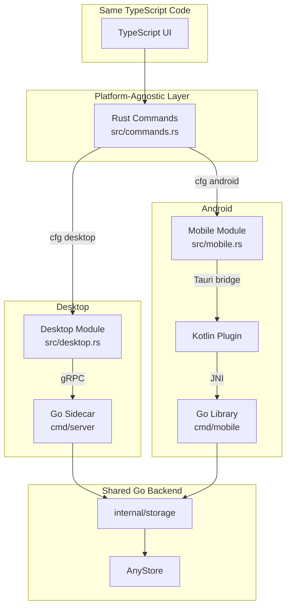
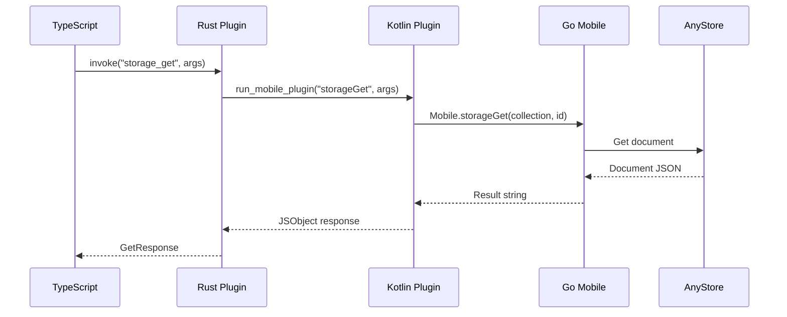

# Design: gomobile Android Build Integration

## Context

This change introduces Android support by building the existing Go backend with gomobile. The implementation reuses the storage layer from desktop, changing only the transport layer from gRPC (sidecar) to direct function calls (embedded library).

**Constraints:**
- Must work with AnyStore (verified: pure-Go, no CGo)
- Follow same binary distribution pattern as desktop
- Minimize platform-specific code
- Keep Go API gomobile-compatible from the start

**Stakeholders:**
- Plugin consumers building Android apps
- Future iOS implementers (similar patterns)
- Desktop plugin maintainability (shared code)

## Goals / Non-Goals

**Goals:**
- Validate gomobile + AnyStore integration end-to-end
- Establish mobile binary distribution pattern
- Prove same TypeScript API works on Android
- Keep implementation minimal (<500 LOC new code)

**Non-Goals:**
- iOS support (Phase 3)
- Android-specific optimizations
- Complex JNI type marshaling
- Automated mobile testing (manual validation only)

## Decisions

### Decision 1: Unified Go Backend

**What:** Reuse existing `internal/storage` layer for both desktop and mobile; no separate mobile implementation.

**Why:**
- Maximizes code sharing (>95% shared)
- Already designed for gomobile compatibility (simple types, no gRPC dependencies)
- Reduces maintenance burden
- Validates architecture assumption about Go API universality

**Alternatives considered:**
- Separate mobile storage implementation: Duplicates code, defeats architecture goal
- gRPC client in mobile package: Unnecessary complexity for in-process calls

### Decision 2: Simple Function Exports

**What:** Export plain Go functions (string, error) directly without protobuf wrappers for mobile.

**Why:**
- Strings are gomobile-compatible primitives
- Simpler than marshaling protobuf messages
- Matches gomobile conventions
- Desktop uses gRPC because it needs IPC; mobile doesn't

**Alternatives considered:**
- Protobuf serialization at boundary: Over-engineering for local calls, adds complexity

### Decision 3: Binary Distribution Pattern

**What:** Follow exact same pattern as desktop binaries:
- Name: `any-sync-android.aar` (parallel to `any-sync-<target-triple>`, distinguishes from future `any-sync-ios.xcframework`)
- Release: GitHub Release assets with SHA256 checksums
- Download: Plugin `build.rs` with checksum verification
- Storage: Same `binaries/` directory alongside desktop binaries
- Local dev: Use same `ANY_SYNC_GO_BINARIES_DIR` override (build.rs picks correct file by name)

**Why:**
- Consistent naming: `any-sync-<platform>[.<ext>]` pattern
- Single binaries location simplifies build logic
- Reuses existing download/verification infrastructure
- No special environment variables needed for mobile
- Android vs iOS distinguished by name, not location

**Alternatives considered:**
- Separate mobile binaries directory: Unnecessary complexity
- Generic `anysync-mobile.aar` name: Doesn't distinguish iOS from Android

## Architecture

### System Components

### Communication Flow

## Implementation Strategy

See `tasks.md` for detailed implementation checklist. High-level approach:

1. **Go Mobile Layer**: Export storage functions with gomobile-compatible signatures (`cmd/mobile/`)
2. **Build Infrastructure**: Add gomobile build to CI, follow desktop binary distribution pattern
3. **Android Integration**: Implement Kotlin plugin to call Go via JNI, handle error propagation
4. **Example Validation**: Initialize Android in example app, test on emulator

## Testing Strategy

**Manual testing only** in this phase (automated testing deferred):
- Build verification: gomobile completes, .aar contains all ABIs
- Functional: All storage operations work on Android emulator
- Cross-platform: Same TypeScript code works identically on desktop and Android
- Build system: Consumer builds without gomobile installed

Detailed checklist in `tasks.md`.

## Risks / Trade-offs

### Risk: modernc.org/sqlite Android Compatibility

**Status:** Low (verified pure-Go, but untested on Android)  
**Mitigation:** Early emulator testing; document any Android-specific file system issues

### Risk: gomobile Version Compatibility

**Status:** Medium (gomobile has SDK version dependencies)  
**Mitigation:** Pin gomobile version in CI, document requirements

### Trade-off: Pre-built Distribution

**Decision:** Pre-built .aar (consistent with desktop)  
**Pros:** No gomobile for consumers, proven pattern  
**Cons:** ~15-20MB release artifact, CI complexity  
**Justification:** Developer experience prioritized over artifact size

## Migration Plan

No migration needed - additive change. Desktop apps continue working unchanged.
