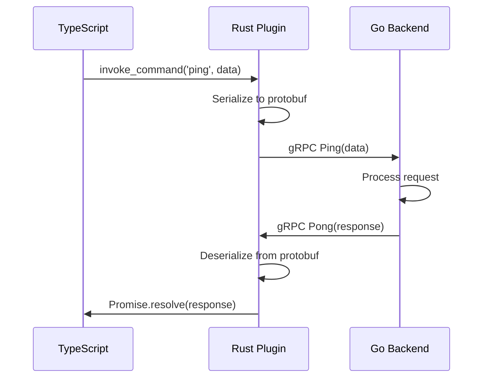
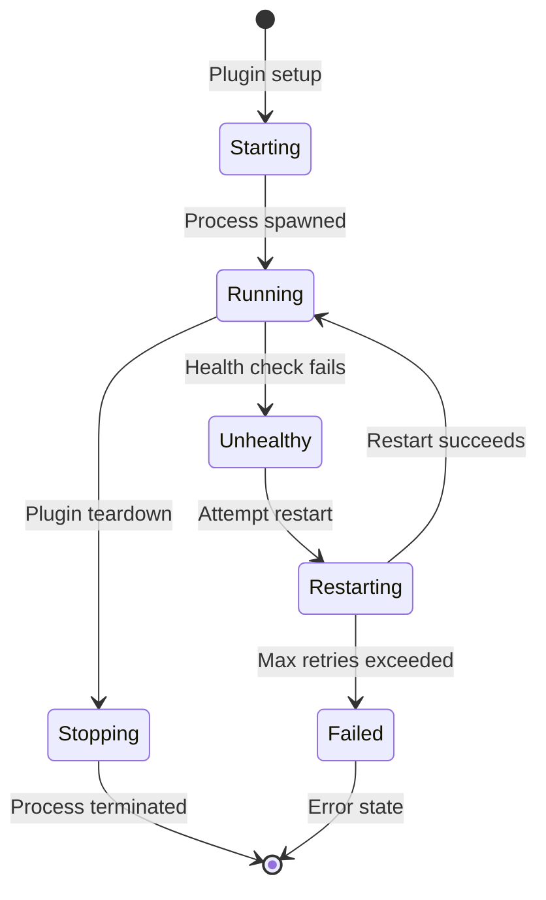

# Phase 0 Design: Go Backend Architecture and Integration

## Overview

Phase 0 establishes the foundational architecture for integrating a Go backend with the Tauri plugin. This design focuses on minimal scaffolding that enables communication between all layers while deferring complex functionality to later phases.

## Architecture Decisions

### 1. Go Backend Structure

**Rationale**: Follow the PRD's recommended pattern with clear separation between internal logic (unrestricted Go) and API boundary (gomobile-compatible).

```
go-backend/
├── api/
│   ├── proto/           # gRPC protobuf definitions
│   └── server/          # gRPC server implementation
├── internal/
│   ├── health/          # Basic health check service
│   └── config/          # Configuration management
└── cmd/
    └── server/          # Desktop sidecar entrypoint
```

**Key Points**:
- `api/` layer enforces gomobile-compatible types
- `internal/` packages can use any Go features
- Protocol buffers define the contract between Rust and Go
- Single entrypoint for desktop sidecar mode

### 2. gRPC Communication Protocol

**Rationale**: gRPC provides type-safe contracts and will support future streaming needs.

**Phase 0 Scope**:
- Simple unary RPC calls only (no streaming)
- Basic health check and ping services
- Error handling with gRPC status codes

**Protocol Definition**:
```protobuf
service HealthService {
  rpc Check(HealthCheckRequest) returns (HealthCheckResponse);
  rpc Ping(PingRequest) returns (PingResponse);
}
```

### 3. Desktop Integration Pattern

**Rationale**: Sidecar process avoids FFI complexity and toolchain conflicts.

**Process Flow**:
1. Tauri plugin setup spawns Go sidecar process
2. Sidecar listens on random localhost port
3. Rust plugin connects via gRPC client
4. Communication flows through gRPC calls
5. Plugin handles sidecar lifecycle (start/stop/restart)

**Implementation Details**:
- Use `tokio::process::Command` for process spawning
- Random port allocation to avoid conflicts
- Health checks for process monitoring
- Graceful shutdown on app exit

### 4. Error Handling Strategy

**Rationale**: Need clear error mapping between Go, Rust, and TypeScript layers.

**Approach**:
- Go: gRPC status codes with error messages
- Rust: Convert gRPC errors to plugin-specific error types
- TypeScript: Receive structured error objects

**Error Flow**:
```
Go Error (gRPC status) → Rust Error (enum) → TypeScript Error (class)
```

### 5. Configuration Management

**Rationale**: Need flexible configuration for different environments.

**Configuration Sources**:
1. Default values (embedded)
2. Environment variables
3. Configuration files (optional)

**Phase 0 Configuration**:
- Server bind address (localhost)
- Logging level
- Health check intervals

### 6. Logging Strategy

**Rationale**: Need observability across process boundaries.

**Approach**:
- Go backend: Structured logging to stderr
- Rust plugin: Forward sidecar logs to Tauri logger
- TypeScript: Access logs through plugin API

## Integration Patterns

### TypeScript → Rust → Go Flow



### Process Lifecycle Management



## Technical Considerations

### 1. Port Management
- Use random available port for each instance
- Port communicated via command line or environment
- Cleanup on process exit

### 2. Binary Distribution
- Go binaries compiled for each target triple
- Stored in `binaries/` directory
- Included in plugin package

### 3. Build Integration
- Go build integrated into Rust build process
- `build.rs` or cargo build script handles compilation
- Cross-compilation support for all platforms

### 4. Testing Strategy
- Unit tests for Go backend logic
- Integration tests for gRPC communication
- End-to-end tests through TypeScript layer

## Future Extensibility

### Phase 1+ Preparation
- gRPC service definitions ready for AnySync integration
- Internal package structure prepared for storage/sync logic
- Mobile integration points defined (gomobile boundary)

### Scalability Considerations
- gRPC streaming support planned
- Connection pooling for multiple concurrent requests
- Configuration for production deployments

## Risk Mitigation

### 1. Process Management Complexity
- **Risk**: Sidecar process management adds complexity
- **Mitigation**: Robust health checking, automatic restart, comprehensive error handling

### 2. gRPC Version Compatibility
- **Risk**: Protocol buffer version conflicts
- **Mitigation**: Pin versions, generate code from single source of truth

### 3. Cross-Platform Build Issues
- **Risk**: Go cross-compilation failures
- **Mitigation**: CI/CD pipeline testing, fallback to manual builds

### 4. Performance Overhead
- **Risk**: IPC overhead impacts performance
- **Mitigation**: Benchmark baseline, optimize in later phases if needed

## Success Metrics

1. **Functional**: End-to-end ping works reliably
2. **Performance**: Round-trip latency < 50ms for simple calls
3. **Reliability**: Sidecar auto-recovery from crashes
4. **Maintainability**: Clear separation of concerns, well-documented interfaces
5. **Extensibility**: Architecture supports Phase 1+ requirements without major changes