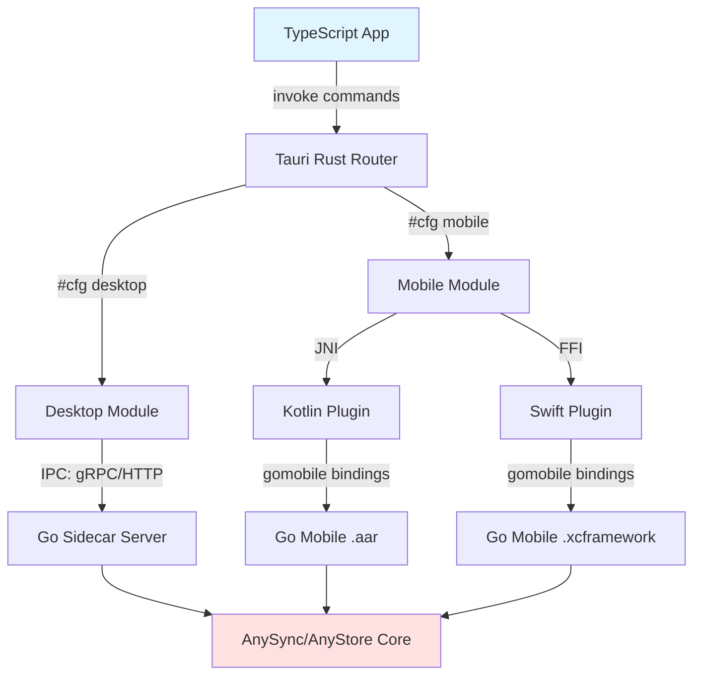
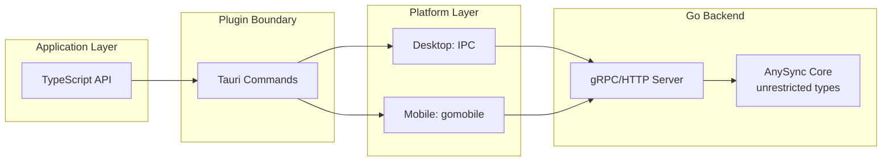
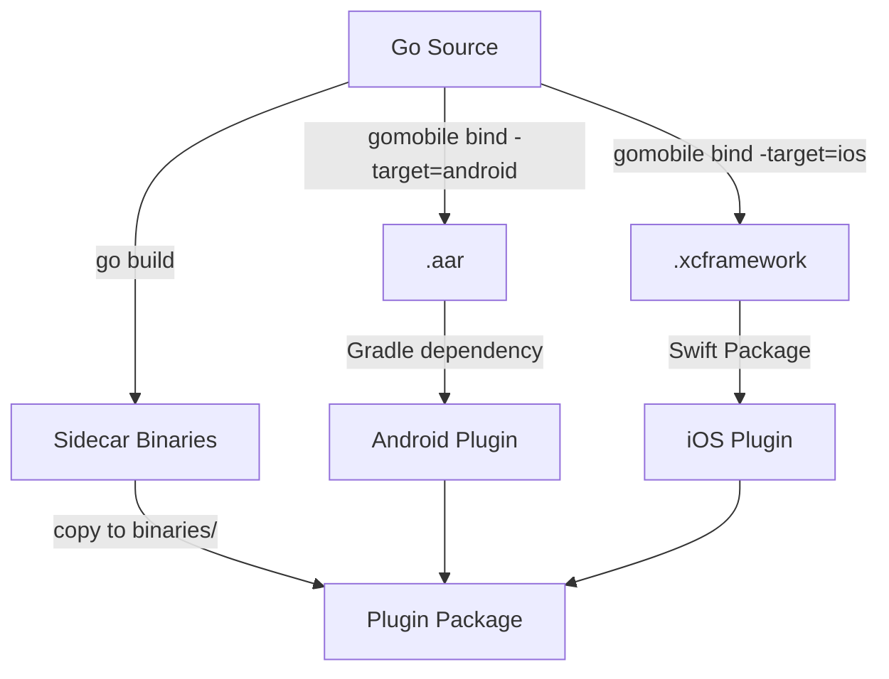

# Product Requirements Document: tauri-plugin-any-sync

## Executive Summary

A cross-platform Tauri plugin that provides unified storage and synchronization capabilities powered by AnySync/AnyStore, supporting desktop (Windows, macOS, Linux) and mobile (iOS, Android) from a single TypeScript API surface.

## Relevant resources

- AnySync
  - https://tech.anytype.io/any-sync/overview
  - https://github.com/anyproto/any-sync
- AnyStore
  - https://github.com/anyproto/any-store
- Tauri
  - https://tauri.app/develop/plugins
  - https://tauri.app/develop/plugins/develop-mobile

## Core Objectives

1. **Platform Abstraction**: Hide platform-specific implementation details behind a unified TypeScript API
2. **Code Reuse**: Maximize Go backend code sharing across all platforms (target: 95%+)
3. **Developer Experience**: Allow application developers to work primarily in TypeScript
4. **Data Sovereignty**: Enable local-first storage with optional P2P synchronization

## Architecture Overview

### High-Level Component Flow



## Platform-Specific Strategies

### Desktop: Sidecar Process Pattern

**Rationale**: Avoids Rust↔Go FFI complexity and Windows MSVC/MinGW toolchain conflicts.

**Mechanism**:
- Go backend compiled as standalone executable
- Bundled in `binaries/any-sync-<target-triple>` 
- Tauri spawns sidecar on app startup
- Communication via gRPC or HTTP over localhost

**Advantages**:
- Standard Go build process
- Clean process separation
- Easy debugging and testing
- No FFI memory management

**Trade-offs**:
- +5-10MB binary size per platform
- Minimal IPC overhead (acceptable for I/O-bound operations)

### Mobile: gomobile Embedded Library Pattern

**Rationale**: iOS/Android sandboxing prevents child processes; FFI is the only viable integration path.

**Mechanism**:
- Go backend compiled via `gomobile bind`
- Android: `.aar` library consumed by Kotlin plugin
- iOS: `.xcframework` consumed by Swift plugin
- Native plugins invoke Go functions directly

**Advantages**:
- Native integration with platform lifecycle
- No process management complexity
- gomobile handles cross-compilation

**Constraints**:
- API must use gomobile-compatible types only:
  - Primitives: int, float, string, bool
  - Byte slices (read-only)
  - Exported structs with compatible fields
  - Interfaces with compatible methods

### Unified API Design



**Key Principle**: The gRPC/HTTP API layer serves as the natural boundary where complex internal Go types are marshaled to simple, gomobile-compatible types.

## Technical Decisions

### 1. Communication Protocol

**Decision**: Use gRPC with Protocol Buffers

**Rationale**:
- Type-safe contracts
- Efficient binary serialization  
- Bidirectional streaming support (for sync events)
- Auto-generates compatible types
- Works identically on desktop (IPC) and mobile (local calls)

**Alternative Considered**: HTTP/REST - simpler but less efficient for streaming

### 2. Go Backend Architecture

**Structure**:
```
go-backend/
├── internal/
│   ├── sync/      # AnySync integration (any Go types)
│   ├── storage/   # AnyStore logic (any Go types)
│   └── models/    # Internal domain models
├── api/
│   ├── proto/     # gRPC definitions (gomobile-compatible)
│   └── server/    # gRPC server implementation
└── cmd/
    ├── server/    # Desktop sidecar entrypoint
    └── mobile/    # gomobile bind entrypoint
```

**Key Pattern**: Internal packages use unrestricted Go features; `api/` layer enforces gomobile compatibility constraints.

### 3. Plugin Structure

**Organization**:
```
tauri-plugin-any-sync/
├── src/
│   ├── commands.rs       # Unified TypeScript API
│   ├── desktop.rs        # Sidecar management
│   ├── mobile.rs         # Platform dispatch
│   └── error.rs          # Error mapping
├── android/
│   └── src/.../Plugin.kt # Kotlin → gomobile
├── ios/
│   └── Sources/.../Plugin.swift # Swift → gomobile
└── binaries/
    └── any-sync-*        # Pre-built Go sidecars
```

**Compilation Flow**:



### 4. TypeScript API Design

**Principles**:
- Async/Promise-based (all operations asynchronous)
- Single unified interface regardless of platform
- Event-driven for synchronization updates
- Error types map to TypeScript classes

### 5. Lifecycle Management

**Desktop**:
- Sidecar spawned in Tauri `setup()` hook
- Health checks via periodic ping
- Graceful shutdown on app exit
- Restart logic for crash recovery

**Mobile**:
- Go runtime initialized in plugin `init()`
- Survives app backgrounding
- Platform-managed lifecycle (iOS/Android system handles)

### 6. Data Model

**Constraint**: Design data structures to be gomobile-compatible from the start.

Complex nested structures should be JSON-serialized to strings/bytes at the API boundary, then deserialized in Go internal code.

## Non-Functional Requirements

### Compatibility

- Tauri: v2.0+ (mobile support required)
- Go: 1.21+ (for gomobile compatibility)
- Android: API 24+ (Android 7.0)
- iOS: 13.0+

## Success Criteria

1. ✅ Single TypeScript codebase works on all 5 platforms
2. ✅ Go backend code >90% shared between desktop and mobile
3. ✅ Application developers don't need to write Rust, Kotlin, or Swift
4. ✅ All AnySync/AnyStore features accessible via plugin
5. ✅ Zero FFI code in desktop builds
6. ✅ Plugin is generic and reusable by other projects

## Out of Scope

- Web platform support (WebAssembly considerations deferred)
- Direct Rust↔Go FFI on desktop
- Alternative sync protocols beyond AnySync
- UI components (plugin provides data layer only)
- Built-in conflict resolution strategies (application responsibility)

## Risk Mitigation

### Risk: gomobile type restrictions limit functionality

**Mitigation**: Design API boundary with simple types; serialize complex data as JSON/protobuf at boundary.

### Risk: Sidecar process management complexity on desktop

**Mitigation**: Robust health checking, automatic restart, comprehensive error handling.

### Risk: Platform-specific bugs difficult to reproduce

**Mitigation**: Extensive integration testing per platform; maintain platform-specific test suites.

### Risk: gomobile maintenance and updates

**Mitigation**: Abstract gomobile behind internal interfaces; prepare migration path to alternative binding generators if needed.

## Development Phases

**Phase 0**: Scaffold the minimal project with all wiring but no actual functionality.
**Phase 1**: Desktop-only plugin with sidecar pattern  
**Phase 2**: Android support via gomobile  
**Phase 3**: iOS support via gomobile  
**Phase 4**: Advanced features (streaming sync, conflict resolution)

## Appendix: Technology Stack

| Layer | Technology | Rationale |
|-------|-----------|-----------|
| Frontend | TypeScript | Application requirement |
| Framework | Tauri v2 | Cross-platform with mobile support |
| Plugin Core | Rust | Required by Tauri |
| Backend Logic | Go | AnySync/AnyStore written in Go |
| Mobile Bindings | gomobile | Standard Go→mobile FFI |
| IPC Protocol | gRPC | Type-safe, efficient, streaming |
| Mobile Native | Kotlin/Swift | Tauri mobile plugin requirement |
